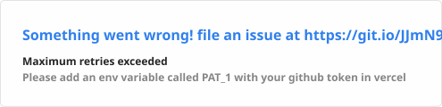
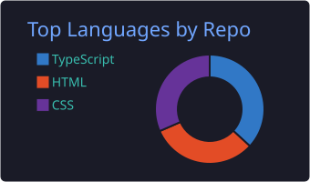

  
   
   
  
   
   
  

 

  

 

###  Identity

- **Role**: Frontend Developer
- **Weapons**: Modern TypeScript, React, and modular architecture.
- **Focus**: Constructing polished, immersive web interfaces and quiet digital spaces.

 

> *"We need to stop living like we have a choice. We build what we must."*  
> — **Core Directive // 0x01**

 

 

###  Arsenal

   
  
   

 

 

###  Dispatches

| Project | Description | Link | Code |
| :--- | :--- | :--- | :--- |
| **[PROJECT_NAME_1]** | *[Short one-line description describing the architecture or mood]* | [Live](#) | [Repo](#) |
| **[PROJECT_NAME_2]** | *[Short one-line description describing the architecture or mood]* | [Live](#) | [Repo](#) |
| **[PROJECT_NAME_3]** | *[Short one-line description describing the architecture or mood]* | [Live](#) | [Repo](#) |

 

 

###  Metrics

   
  
   
   
  
   
   
  

 
 

  
   
   
  
   
  
I only consume what I build.

